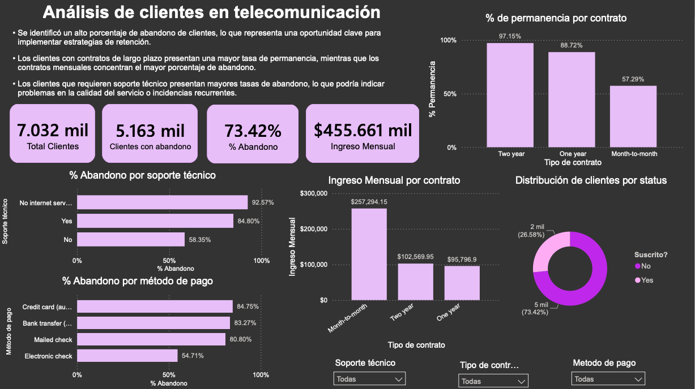

# Análisis de Clientes en Telecomunicaciones

## Descripción

Este proyecto se enfoca en el análisis del comportamiento de clientes en una empresa de telecomunicaciones, con el objetivo de identificar los factores asociados a la cancelación de suscripciones (subscription status).

El propósito principal es generar insights que permitan diseñar estrategias de retención basadas en datos.

## Objetivos

* Analizar datos de clientes para identificar patrones de cancelación
* Evaluar el impacto del tipo de contrato, soporte técnico y método de pago
* Desarrollar un dashboard interactivo para monitoreo de métricas clave
* Generar insights accionables para mejorar la retención de clientes

## Dataset

El conjunto de datos incluye información a nivel cliente, como:

* ID del cliente
* Tipo de contrato
* Método de pago
* Soporte técnico
* Ingresos mensuales
* Estado de suscripción (subscription status)

## Preparación de datos (SQL)

La limpieza y transformación de los datos se realizó en SQL, incluyendo:

* Creación y validación de la base de datos
* Tratamiento de valores nulos e inconsistentes
* Estandarización de tipos de datos
* Creación de campos calculados
* Desarrollo de consultas y procedimientos para análisis

## Métricas clave (KPIs)

* Total de clientes: 7,032
* Clientes con cancelación: 5,163
* Tasa de cancelación: 73.42%
* Ingreso mensual: $455,661

## Dashboard (Power BI)

Se desarrolló un dashboard interactivo para visualizar el comportamiento de los clientes y facilitar la toma de decisiones.

### Visualizaciones

* Porcentaje de permanencia por tipo de contrato
* Porcentaje de cancelación por soporte técnico
* Porcentaje de cancelación por método de pago
* Ingreso mensual por tipo de contrato
* Distribución de clientes por estado de suscripción

### Filtros

* Soporte técnico
* Tipo de contrato
* Método de pago

### Vista previa del dashboard final

## Insights clave

* Se identificó una alta tasa de cancelación (73%), lo que representa una oportunidad crítica de mejora
* Los clientes con contratos mensuales presentan mayor probabilidad de cancelación
* Los contratos de largo plazo están asociados con mayor retención
* Los clientes que utilizan soporte técnico presentan mayores tasas de cancelación, lo que puede indicar problemas en la calidad del servicio

## Conclusión

El análisis demuestra que la cancelación de clientes no es aleatoria, sino que está influenciada principalmente por el tipo de contrato y la experiencia del cliente.

El dashboard permite identificar segmentos de alto riesgo y facilita la toma de decisiones basada en datos.

## Herramientas utilizadas

* SQL (limpieza y transformación de datos)
* Power BI (visualización y desarrollo del dashboard)

## Autor

René Bedolla
